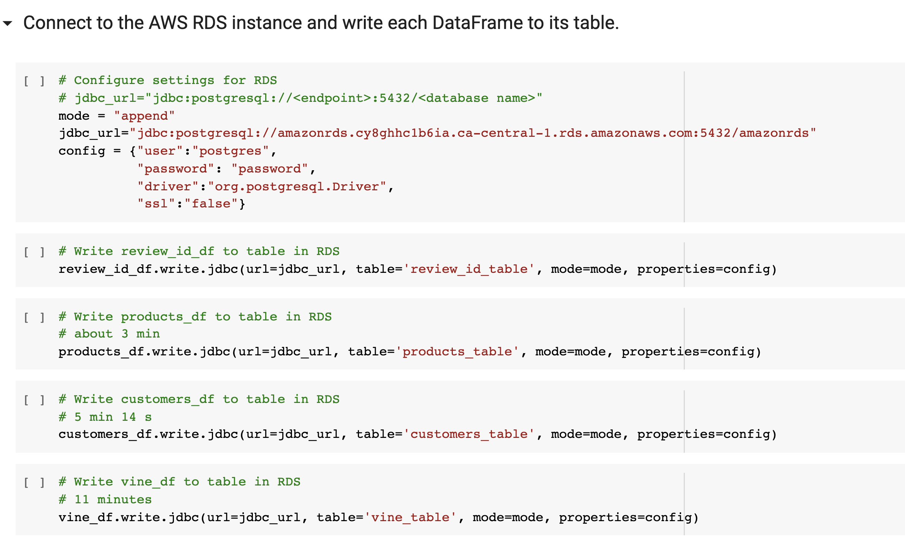

# Amazon_Vine_Analysis

## Overview 

Analyze Amazon reviews written by members of the paid Amazon Vine program. The Amazon Vine program is a service that allows manufacturers and publishers to receive reviews for their products.

Deliverable 1: Perform ETL on Amazon Product Reviews

Deliverable 2: Determine Bias of Vine Reviews

Resources: Amazon Dataset "Digital Video Games".

## Results:

### Deliverable 1: Perform ETL on Amazon Product Reviews

The cloud ETL process with creation of an AWS RDS database with tables in pgAdmin.

1. Use Amazon Dataset: Digital Video Games: 
 
https://s3.amazonaws.com/amazon-reviews-pds/tsv/amazon_reviews_us_Digital_Video_Games_v1_00.tsv.gz

2. Create customer_table.

3. Create products_table.

4. Create review_id_table.

5. Create vine_table.

6. Load the DataFrames into pgAdmin.

7. Check the pgAdmin tables.

Customers_table:

Products_table:

Review_id_table:

Vine_table:

### Deliverable 2: Determine Bias of Vine Reviews

Use the PySpark, Pandas, or SQL in order to determine if there is any bias towards reviews that were written as part of the Vine program. Determine if having a paid Vine review makes a difference in the percentage of 5-star reviews.

1. Filter the Digital_Video_Games dataset for total votes.

2. Filter DataFrame for helpful_votes ratio above or equal 50%

3. Create paid DataFrame.

4. Create unpaid DataFrame.

5. Total number of paid and paid 5 star reviews.

6.  Total number of unpaid and unpaid 5 star reviews.

 - How many Vine reviews and non-Vine reviews were there? 

Vine reviews: 0
Non-Vine reviews: 1685

- How many Vine reviews were 5 stars? 

Zero

- How many non-Vine reviews were 5 stars?

631

- What percentage of Vine reviews were 5 stars? 
It is not applicable, because of zero paid reviews.

- What percentage of non-Vine reviews were 5 stars?
34.4%

## Summary:

The Digital Video Games dataset has no paid reviews. It means that the digital video games did not use the Vine system services. 
The total number of reviews is 1685. Where 34.4% of reviews are 5 stars reviews. There is no positivity bias, because all reviews are not paid. 

I would suggest to start using the Vine system in order to increase the number of 5 stars reviews by 2 times. Then, we can run the Digital Video Games dataset analysis again and conclude if there is a possibility of any positivity bias for reviews in the Vine program.
 
